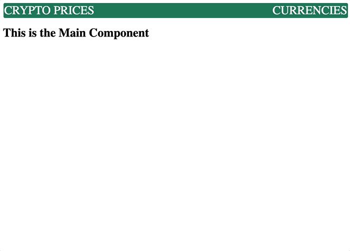

# React Router API App: Real Time Cypto Currency App

In this lab activity,I created a "multi-page" application that displays the prices for common crypto-currencies.

## Learning Objectives

- Create a "multi-page" React application using BrowserRouter.
- Fetch and handle data from an external API in React.
- Create a React application based on given requirements.
- Consume an external API and render its data according to requirements.

## Using React Router

To get started, create a new React app within a project folder, I followed the below steps:

1. Run command `npx create-react-app cryptoprices`.
2. `cd` into the `cryptoprices` folder.
3. Run `npm install react-router-dom`; this is the package that will facilitate our route creation.
4. Delete the contents of the `src` folder and add blank files for `index.js`, `App.js`, and `style.css`.
5. Run `npm start` to start the development server.

# Credit

This project was bootstrapped with [Create React App](https://github.com/facebook/create-react-app).
